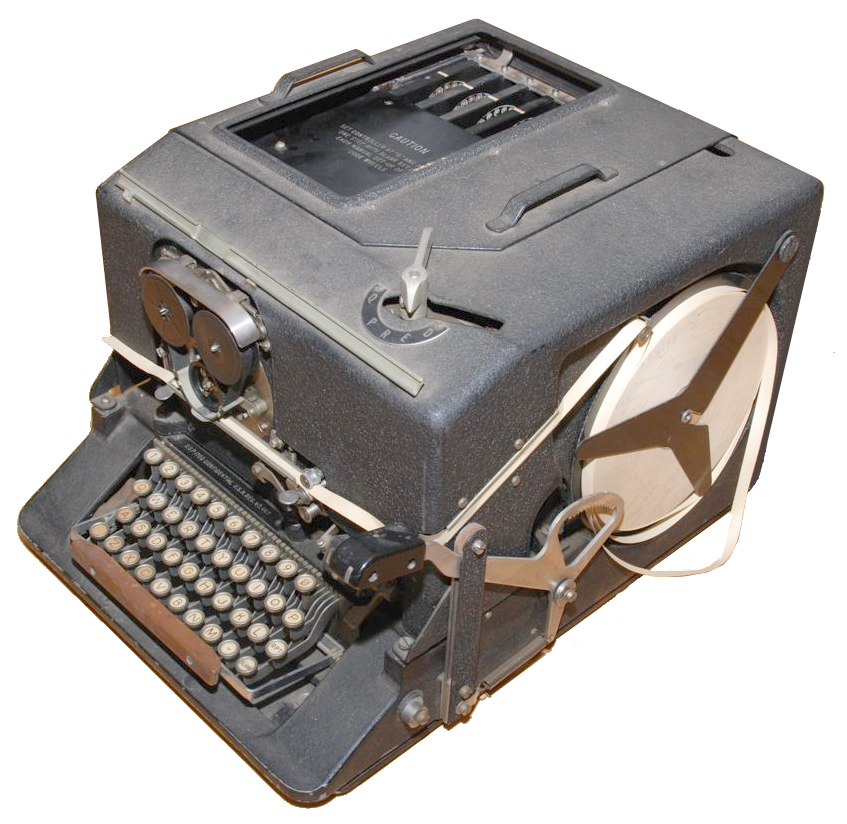
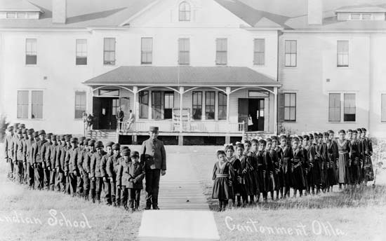
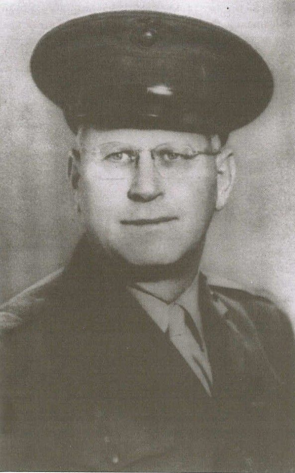
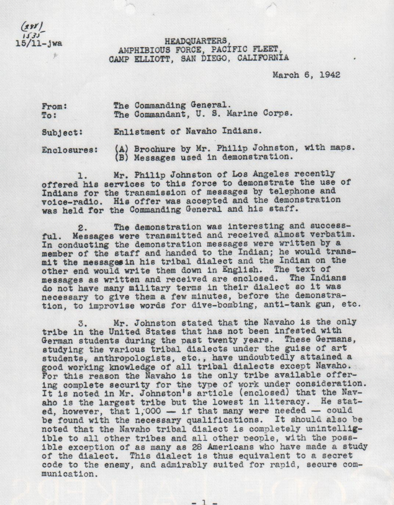
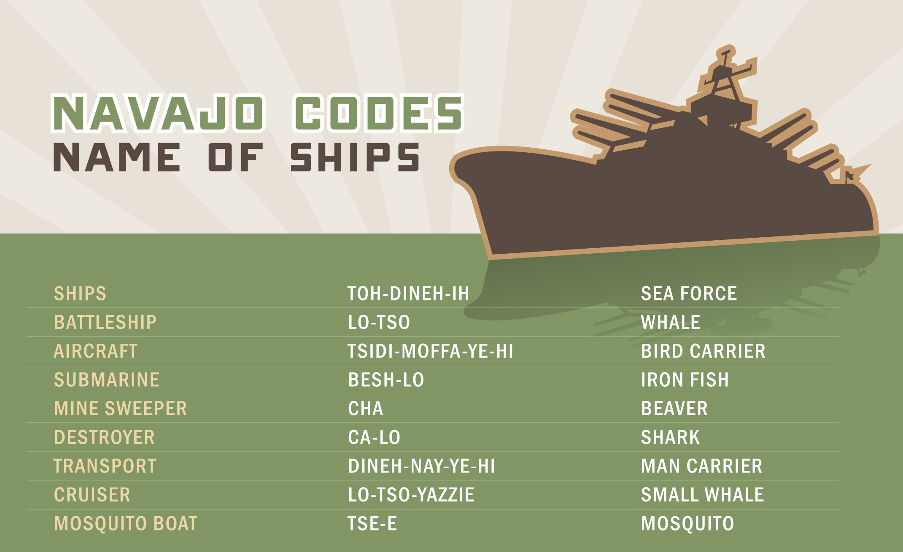

# INTRODUCTION

## Introducing the concept of code talking with the idea of translation

To send secretly a message, we know we can use:
- steganography, hiding the message;
- cryptography, transforming the message into an apparent nonsense with
  the possibility to recover the message for selected persons
  
But there can be imagined another technique, such as:
- translation of the message into an obscure language
This isn't a crypto system because there isn't generally only one way to 
translate a message and some content aren't translatable.

This method have been used during the first halt of the 20th century by people, called code talkers, who transmit by radio
secret messages during wartime. 

This method was particularly used by America which recruit native
American who used their native language. 
	
## Why by that time? 

The first half of the 20th century is the meeting of two conditions that we
think are necessary for the apparition of code talkers:
- The existence of the radio and the phone;
- The fact that most of the cipher machines were too slow and fragile 
- to be used for tactical field communications (as for example the SIGABA)..

## plan

We choose to speak of the Navajo code talkers who are the best know
and whose story is declassified since 1968.

We will first speak of the relation of Navajo and the US in the late 
of the 19th century. Then, we will relate how Navajo code talkers have been recruited
and we will finally study their code. 

# Navajos and US in the begin of the 20th century

## The Long Walk (1864)

According to the website navajocodetalkers.org, Navajo long walk is considered as one of the 
most important parts of Navajo history. 

-  deportation of approximatively 8000 Navajo people by the government of the United States of
 America with a forced trek over 480km into the Bosque Redondo camp.
- Many began the walk exhausted and malnourished
 
They were never informed as to: 

- where they were going; 
- why they were being relocated; 
- and how long it would take to get there. 

The journey lasted 18 days, nearly 200 Navajos died of exposure 
to elements and starvation. 

(source:  https://navajocodetalkers.org/navajo-long-walk/ )

## Boarding schools 

 In the begin of the 20th century, many American Indian children were forced to be in church-operated boarding schools. 
 These schools were Founded to eliminate traditionnal American Indian ways of life: it was forbidden to speak in his native language here. 

The children were forced to
- cut their hair and give up their traditional clothing;
- give up their meaningful Native names and take English ones; 
- replace their traditional religious practices by Christianity. 
They were taught that their cultures were inferior. 

Many Code Talkers attended boarding schools. 
Schools were run like military organizations and this
made it easier for them to adapt to life in the American military.
As adults, they found it puzzling that the same government that had tried to take
away their languages in schools later gave them a critical role speaking their
languages in military service.

    They tell us not to speak in Navajo language. You’re going to school.
    You’re supposed to only speak English. And it was true. They did practice
    that and we got punished if you was caught speaking Navajo.—John Brown,
    Jr., Navajo Code Talker, National Museum of the American Indian interview,
    2004
    

    
(source: http://nmai.si.edu/education/codetalkers/html/chapter3.html )

# Navajos as code-talkers: how they have been recruited.

## Preliminary: the code talkers during the WWI

The first use of native American code talker : Cherokee. During Second Battle
of the Somme in September 1918.  Unit 30th Infantry Division were under British
command.

During WW1, Germans tapped into telephone lines of American, break their codes,
and captured runners send out to deliver messages directly. So, they have some
tactical plans of enemies in their hands.

	Blocked situation in 1918. An idea pop because Captain Lawrence
	of US Army eared two Choctaw (Solomon Louis and Mitchell Bobb)
	talking together in their own language the Choctaw => creation
	code talkers. Find 8 Choctaw in battalion and 14 in 36th
	Infantry Division. They used them to build a code with 20 terms
	and transmit secret tactical messages in their native language.
	They helped to win during the Meuse-Argonne Offensive. In 24
	hours, they turned the tide of the battle. And in 72, Germans
	are going back.

## Pacific War and the idea of Philip Johnston
	
- December 7 1941: Attack on Pearl Harbor
- Pacific war: 7 December 1941 – 2 September 1945		

 
Philip Johnston was a World War I veteran who had grown  up on the
Navajo reservation while his parents served there as missionaries. 
He was one of the few non Navajo people to master the Navajo language:
at 9 years old, he was  asker to  serve as an interpreter for a Navajo
delegation. 

In 1942, he proposed to the Marine Corps that Navajos and
other tribes could be recruit as code talkers.	

There was some concerns about this idea. Firstly, German send after the
first world war 30 anthropologists in America to learn native American
languages. Luckily, they didn't have the time to learn Navajo: there 
were too many languages to learn.

After some hesitations, the major general Clayton Barney Vogel 
accepted to give this idea a try.  
Johnston recruited four bilingual Navajos and, on February 28,
they go to Camp Elliott for a demonstration. 
Two 

Two of the Navajos had to translate in Navajo typical military field orders and to
to send it by radio to their companions who translated it in English.

For example, they translated 
"Enemy expected to make tank and dive bomber attack at dawn." 
into "Enemy tank dive bomber expected to attack this morning." They was
able to translate such message in approximatively 20 seconds, much
better than the 30 minutes needed by machines at that time.

The demonstration was a success and Major General Clayton wrote a
letter to the commandant of the Marine Corps recommending the Navajo code
talkers.

(
https://www.archives.gov/files/education/lessons/code-talkers/images/letter-01.jpg
)

In May 1942, 29 Navajos recruit task develop a Navajo code.
Altogether, between 375 to 420 Navajos participate to the program. 

#### transition
Let's see now some reason, some wrote  in the letter, that justifies   
the choice of Navajo and let's see how the Navajo code worked.
 
# Navajo and Navajo code..

	Code Talkers were given the messages in English. Without writing them down,
	they translated and sent them to another Code Talker. After the message was
	transmitted and received, it was written down in English and entered into a
	message logbook. The Code Talkers also sent messages in English. Messages were
	only coded when absolute security was needed.

## Why the Navajo language was a good choice?
- The largest population of Native American so the possibility to recruit and
  from enough code talkers;
- It remained mostly "unwritten".
- Except the Navajos, only a handful of American experts were able to speak 
  langage. Notably, German didn't know it even if they send some people
  to learn native American language before the begin of the WW2. -> less than
  30 non Navajo people could understand it according to the letter of major
  general Clayton.
- Navajo has a complex grammar, different from German and Japanese 
- faster than any machine at this time.

PUT HERE a sample of the Navajo language. 

## The code
 
## How it works 
Because of a lack of military terms in the Navajo language, there was the need
for a code which consist in two different parts:
- A dictionary for common military words; using for example fish's names for ships
- and bird's names for planes. 
- (source for the picture
  https://www.cia.gov/news-information/featured-story-archive/2008-featured-story-archive/navajo-code-talkers/)

- A phonetic alphabet table, to spell word that aren't in the Navajo language
  nor the precedent dictionary;

	  So we start talking about different things, animals, sea creatures, birds,
	  eagles, hawks, and all those domestic animals. Why don’t we use those names
	  of different animals—from A to Z. So A, we took a red ant that we live with
	  all the time. B we took a bear, Yogi the Bear, C a Cat, D a Dog, E an Elk, F,
	  Fox, G, a goat and so on down the line.—Chester Nez, Navajo Code Talker,
	  National Museum of the American Indian interview, 2004
	  
  Navajo Code Talkers memorized 17 pages of code during their training.
  
	  Carl Gorman joined the United States Marine Corps in 1942 when he learned
	  they were recruiting Navajos. He went through all of the difficult training
	  and was one of the original 29 Navajos who were given the secret mission of
	  developing the Navajo code. Carl answered one of his officers who had asked
	  why Navajos were able to memorize the complex code so quickly: 
	  
	  “For us, everything is memory, it’s part of our heritage. We have no written language.
	  Our songs, our prayers, our stories, they’re all handed down from grandfather
	  to father to children—and we listen, we hear, we learn to remember
	  everything. It’s part of our training.” (Power of a Navajo: Carl Gorman, the
	  Man and His Life, by Henry and Georgia Greenberg,1996) 

### Advantage and inconvenient of the code
Advantages:
- It's difficult to to distinguish the sounds for uninitiated Navajo Speakers;
- Imposture aren't easy to make: it require to speak Navajo with a good accent.
- Again faster than a machine they encode in just 20 seconds, and machine in 30 minutes.
Inconvénients:
- non uniqueness of the translations on a message;
- Navajos trained at different times and place used sometimes 
  différents words for specific military vocabulary, the solution
  was to frequently "exchange" Navajos from one division into another.
- There was not enough code talkers and some battalions remained without 
  the capacity to decrypt or encrypt messages.
  source: https://www.archives.gov/education/lessons/code-talkers , le
- Kerckhoffs's principles aren't observed: all the secret is in the code talkers.
  (Because of the code, to speak Navajo isn't sufficient).
	  

## Evolution of the code
- In the first version of the code, there was only one word for each 
  letter of the alphabet. A cryptographer thought that 
  the code might be broken because of the risk of repetition 
  of some patterns when spelling out words not in the Navajo's
  vocabulary. As a result, more words has been added for the most
  frequency used letters in subsequent versions.
- "the original 211 vocabulary terms were also expanded to 411" 
source: https://www.archives.gov/education/lessons/code-talkers

A mettre quelque part:
The Navajo code is the only spoken military code never to have been deciphered

source: https://www.nytimes.com/2014/06/06/us/chester-nez-dies-at-93-his-native-tongue-helped-to-win-a-war-of-words.html?_r=0

# Conclusion: 
##Declassification and recognition of code talkers after the war
 
- The program has been classified until 1968.
- In 2000, the US Congree passed legislation to honor the Navajo Code Talkers
  and give them special gold and silved congressional medals.
- In 2008, the Code talkers recognition act was signed into law by president
  George W. Bush, which recognizes every other native american code talker who served
  in the United States military durring WWI or WWII 

## Actual Situation of the Navaho

    - Current population: The Navajos have more than 300,000 tribal members.
    - Politicaly divised between two federally recognized tribes: Navajo Nation
      (the largest land area detained by a Native American tribe) and Colorado 
      Rived Indian Tribes.
    
    Tribal government: Navajo government operates under a constitution with a
    President, Vice President, Council (with 88 delegates), court system,
    police force, college, and many other programs and services for the Navajo
    people.

## Opening..
Débat : Serait-il possible de refaire cette technique un jour? Mélangée avec des techniques modernes, est-ce que ça pourrait être déconcertant pour des ennemis?

# OH MY GOD
https://www.nytimes.com/2017/11/27/us/politics/trump-elizabeth-warren-pocahontas-navajo.html
